# Lab 1 HTTP File Server — Demonstration Report

## 1. Environment & Startup

Command executed:
```
docker compose up --build
```
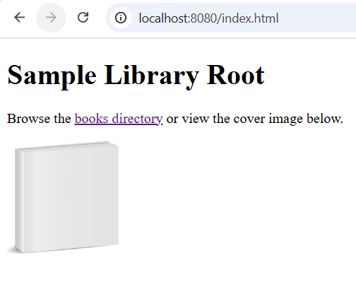

## 2. Directory Structure Served
Base directory passed to server: `content/`

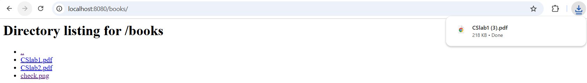

Short explanation: Contains required HTML, PNG, multiple PDFs, and nested directory.

## 3. Accessing the Root Directory
Open in browser:
```
http://localhost:8080/
```
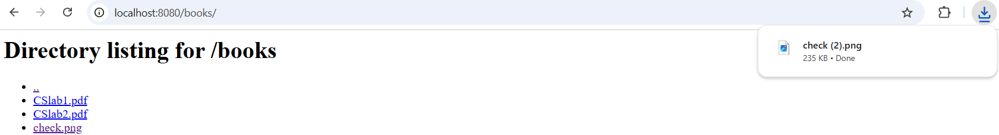

## 4. Root HTML Page With Image Reference
Open:
```
http://localhost:8080/index.html
```
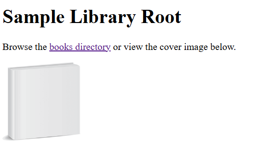

## 5. Nested Directory Listing
Navigate:
```
http://localhost:8080/books/
```
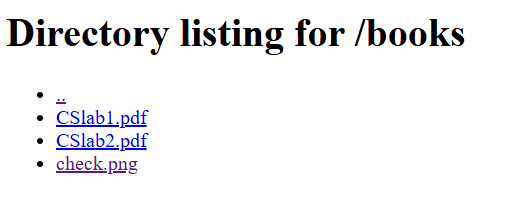

## 6. Downloading a PDF
Click `CSlab1.pdf` (or request directly):
```
http://localhost:8080/books/CSlab1.pdf
```
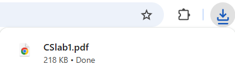

## 7. Client Usage (HTML Fetch)
Command:
```
python src\client.py localhost 8080 index.html
```
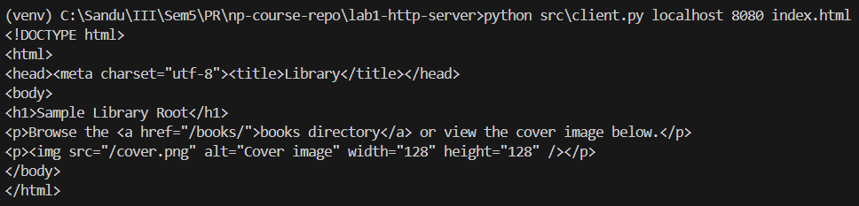

## 8. Client Usage (PDF Download)
Command:
```
python src\client.py localhost 8080 books/CSlab2.pdf
```
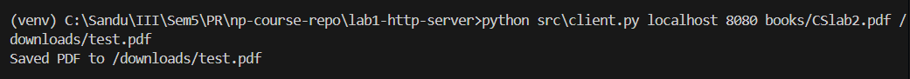
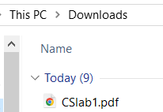

## 9. Client Usage (Directory Listing)
Command:
```
python src\client.py localhost 8080 books/
```
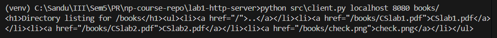

## 10. LAN Access Test (Optional Bonus)
From another device (replace with actual LAN IP):
```
python src\client.py 192.168.1.37 8080 index.html
```
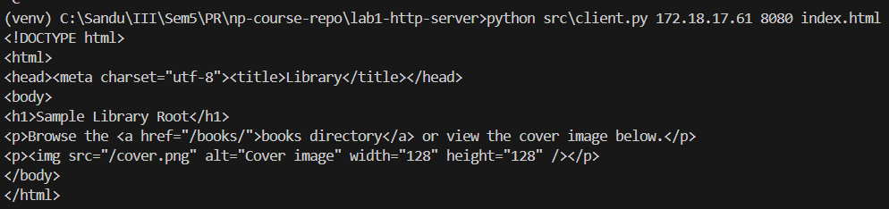

## 11. Error Handling (404 Example)
Request unsupported or missing file:
```
http://localhost:8080/unknown.xyz
```
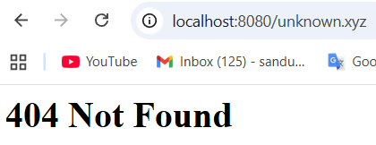

Or via client:
```
python src\client.py localhost 8080 unknown.xyz
```
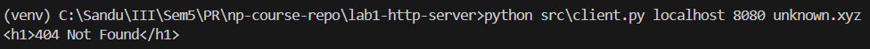

## 12. Compliance Summary

- Docker & Compose: Implemented
- Single-request TCP server: Implemented
- File types: HTML, PNG, PDF served
- 404 behavior: Correct for missing/unsupported
- Directory listing: Implemented (nested)
- Subdirectory with PDFs/PNG: Present (`books/`)
- Client: Implements required CLI format; prints HTML, saves PNG/PDF
- Image referenced via : Present in index.html
- Bonus (LAN browsing): Possible; steps documented

## 13. How to Stop
```
CTRL+C

docker compose down
```
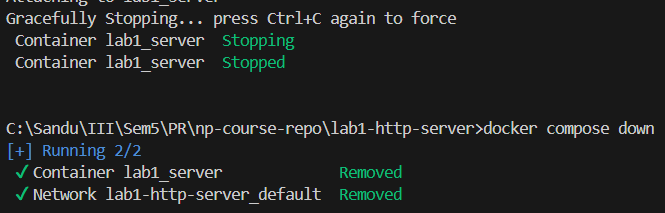

## 14. Notes / Design Choices
- Only required extensions are served; others 404 for clarity.
- Path traversal guarded by normalized path prefix check.
- Minimal standard library only (no external dependencies).

---
End of Report.
