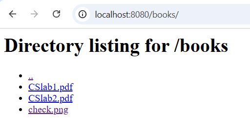

(Lab 1) HTTP file server — Report

1) Contents of the source directory

 - src/server.py  — TCP-socket single-threaded HTTP file server implementation
 - src/client.py  — simple HTTP client using raw sockets (saves PDFs/PNGs, prints HTML)
 - Dockerfile     — builds a Python 3.11-slim image and copies `src/` and `content/`
 - docker-compose.yml — starts the `webserver` service and maps host port 8080
 - content/       — directory served by the server (contains index.html, cover.png, books/)
 - REPORT.md      — this report

2) Docker Compose and Dockerfile contents

docker-compose.yml

```
services:
	webserver:
		build: .
		container_name: lab1_server
		working_dir: /app
		command: ["python", "src/server.py", "content"]
		ports:
			- "8080:8080"
		volumes:
			- ./:/app
```

Dockerfile

```
FROM python:3.11-slim

WORKDIR /app

COPY src/ /app/src
COPY content/ /app/content

EXPOSE 8080

CMD ["python", "src/server.py", "content"]
```

3) How I start the container

From the `lab1-http-server/` directory on the host:

```cmd
docker-compose up --build
```

Or to run detached:

```cmd
docker-compose up --build -d
```

4) Command that runs the server inside the container (and with a directory argument)

The container runs the following command:

python src/server.py content

This starts the server serving the `content/` directory that is available in `/app/content` inside the container.

5) Contents of the served directory

Layout of `content/` (list):

- content/index.html    — HTML page linking to `/books/` and showing `/cover.png`
- content/cover.png     — PNG referenced by index.html
- content/books/        — subdirectory with PDF and PNG files
	- content/books/CSlab1.pdf
	- content/books/CSlab2.pdf
	- content/books/check.png

6) Example requests (4 files) and expected/observed results

- Request 1: Inexistent file → 404

	Request path: /no-such-file.pdf

	Observed response: 404 Not Found HTML page (server returns HTTP/1.1 404 Not Found and a small HTML body)

    

- Request 2: HTML file with image

	Request path: /index.html (or /)

	Observed response: HTTP/1.1 200 OK, Content-Type: text/html; charset=utf-8 and the body contains HTML that references `/cover.png` with an  tag. The image file exists at `/cover.png` so the page displays the image.
    
    
    
- Request 3: PDF file

	Request path: /books/CSlab1.pdf

	Observed response: HTTP/1.1 200 OK, Content-Type: application/pdf. Server sets `Content-Disposition: attachment; filename="CSlab1.pdf"` so the client browser will typically download the file instead of rendering inline.

	

- Request 4: PNG file

	Request path: /cover.png

	Observed response: HTTP/1.1 200 OK, Content-Type: image/png.

	

7) Client usage (I implemented `src/client.py`)

 - Example client command to print an HTML directory listing:

```cmd
python src/client.py localhost 8080 /books/ .
```

 - Example client command to download a PDF to `downloads/`:

```cmd
python src/client.py localhost 8080 /books/CSlab1.pdf downloads/
```

Observed output when running client for `/books/CSlab1.pdf`:

- stdout: "Saved PDF to downloads/CSlab1.pdf"
- file saved: downloads/CSlab1.pdf (binary PDF bytes)

If the Content-Disposition header is present, the client uses the filename suggested there when saving.

8) Directory listing generated page (when requesting a directory)

 - Example request: GET /books/

 - Server response: A generated HTML page containing links for each item in `content/books/`. Directories are shown with trailing `/` and a `..` link to navigate up.

 

9) Browsing the server from a phone (how I connected)
 - Find the host IP (Windows):

	 1. Open Command Prompt and run:

		 ```cmd
		 ipconfig
		 ```

		 Look for the `IPv4 Address` under the active adapter (e.g. `Wireless LAN adapter Wi‑Fi`). Example: `192.168.87.235`.

	 2. Quick filter:

		 ```cmd
		 ipconfig | findstr IPv4
		 ```

 - Windows firewall / router rules: If the phone cannot reach the host, allow incoming TCP port 8080 in Windows Defender Firewall (or temporarily disable firewall for testing). On Windows: Firewall > Advanced Settings > Inbound Rules > New Rule > Port > TCP 8080 > Allow.

 - From the phone browser, open:

	 http://<HOST_IP>:8080/

	 Replace `<HOST_IP>` with the IPv4 address you found (for example `http://192.168.87.235:8080/`). The index page should load; follow links to `/books/` or open individual files.

 - If you prefer to use the provided client, you can run `src/client.py` on another machine and point it at the host IP and port to download files.

    
    

10) Notes, caveats and recommendations

 - The server prevents path traversal by checking that the resolved full path is inside the served directory — this mitigates a common security problem.
 - The server reads only up to the first 1024 bytes of the request in the current implementation; this is sufficient for lab-sized simple GET requests but larger headers could be truncated. If desired, the request read loop can be made to read headers until `\r\n\r\n` is seen.
 - By default the server currently attaches `Content-Disposition: attachment` to PNGs which may force downloads instead of inline display; I recommend removing this header for image files so that pages embedding images display them naturally. PDFs are fine as attachments if the intention is to download books.

11) How to reproduce (quick checklist)

 - Build and run with Docker Compose:

 ```cmd
 cd lab1-http-server
 docker-compose up --build
 # open http://localhost:8080 in a browser
 ```

 - Test client:

 ```cmd
 python src/client.py localhost 8080 /books/CSlab1.pdf downloads/
 dir downloads\
 ```

End of report.

