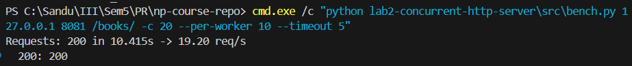

# Lab 2 — Concurrent HTTP Server

Date: 2025-10-22

This report documents the Lab 2 requirements end-to-end using terminal-only tests on Windows. It covers: multithreading with simulated per-request work, a per-path hit counter (naive vs synchronized), and per-IP rate limiting (~5 req/s). Minimal comparisons with Lab 1 are included where relevant.

Servers under test:
- Lab 1 (single-threaded): http://127.0.0.1:8080
- Lab 2 (multithreaded): http://127.0.0.1:8081

Tools:
- Bench tool: `lab2-concurrent-http-server/src/bench.py` (supports concurrency mode and rate mode)
- Curl (Windows) for directory listing inspection

Environment (Lab 2):
- Simulated work: `DELAY_MS=1000` (≈1s per request)
- Rate limiting: `RATE_LIMIT=5`, `WINDOW_SEC=1.0` (per-IP token window)
- Counter mode: `COUNTER_MODE=locked` (synchronized) unless stated otherwise

---

## 1) Multithreaded server with simulated work

Implementation summary:
- Model: thread-per-connection via `threading.Thread` spawned at `accept()`.
- Delay: `time.sleep(DELAY_MS/1000)` in the request handler to simulate ~1s work.
- Binary compatibility with Lab 1 paths and static content.

Terminal tests (Windows cmd):

- Lab 2, burst of 10 concurrent (shows concurrency; rate limiter will cap successes to ~5 in 1s)
```
python lab2-concurrent-http-server\src\bench.py 127.0.0.1 8081 / -c 10 --per-worker 1 --timeout 5
```
Output:
```
Requests: 10 in 1.036s -> 9.66 req/s
  200: 5
  429: 5
```

- Lab 2, burst of 5 concurrent (below limit, clearer 1s concurrency proof)
```
python lab2-concurrent-http-server\src\bench.py 127.0.0.1 8081 / -c 5 --per-worker 1 --timeout 5
```
Output:
```
Requests: 5 in 1.033s -> 4.84 req/s
  200: 5
```

- Lab 1, 10 concurrent (no 1s simulated delay in Lab 1; included for completeness)
```
python lab2-concurrent-http-server\src\bench.py 127.0.0.1 8080 / -c 10 --per-worker 1 --timeout 5
```
Output:
```
Requests: 10 in 2.056s -> 4.86 req/s
  200: 10
```

Note: For a strict apples-to-apples comparison (both with ~1s work), either add a similar delay to Lab 1’s handler or temporarily increase/disable Lab 2’s limiter and compare elapsed time for the same workload on both servers.

---

## 2) Counter feature (naive vs synchronized) — 2 points

Implementation summary:
- Path hit counts stored in an in-memory dictionary.
- Displayed in directory listings as a two-column table: Entry | Hits.
- Two modes:
  - `COUNTER_MODE=naive`: read-modify-write without locking, plus a tiny sleep to expose races.
  - `COUNTER_MODE=locked`: updates via a mutex to eliminate races.

Terminal evidence (locked mode):

- Baseline listing (focus on `books/` entry)
```
curl http://127.0.0.1:8081/
...
<tr><td><a href="/books/">books/</a></td><td>0</td></tr>
...
```

- Send 10 requests to `/books/` (under limit)
```
python lab2-concurrent-http-server\src\bench.py 127.0.0.1 8081 /books/ -c 5 --per-worker 2 --timeout 5
```
Output:
```
Requests: 10 in 2.062s -> 4.85 req/s
  200: 10
```

- Listing after:
```
curl http://127.0.0.1:8081/
...
<tr><td><a href="/books/">books/</a></td><td>10</td></tr>
...
```

Race-condition demonstration steps (naive mode):
1. Restart Lab 2 with `COUNTER_MODE=naive` and `DELAY_MS=1000`.
2. Send many concurrent requests to the same path (e.g., 100 total):
```
python lab2-concurrent-http-server\src\bench.py 127.0.0.1 8081 /books/ -c 20 --per-worker 5 --timeout 5
```
3. Observe that the Hits count is lower than the number of 200 responses (lost increments due to races).
4. Switch back to `COUNTER_MODE=locked` and repeat — now the Hits should match the number of successful requests.

---

## 3) Rate limiting (~5 req/s per IP, thread-safe) — 2 points

Implementation summary:
- Sliding window per client IP stored as a deque of timestamps.
- Guarded by a lock for thread safety.
- Exceeding the limit returns HTTP 429.

Terminal evidence:

- Burst above limit (20 concurrent):
```
python lab2-concurrent-http-server\src\bench.py 127.0.0.1 8081 / -c 20 --per-worker 1 --timeout 5
```
Output:
```
Requests: 20 in 1.024s -> 19.54 req/s
  200: 5
  429: 15
```

- Below-limit behavior: A single worker with ~1s simulated work can only achieve ~1 req/s, well below the threshold. To approach the limit without exceeding it, keep effective combined rate ≤ 5 req/s. One practical proof (short batch below limit):
```
python lab2-concurrent-http-server\src\bench.py 127.0.0.1 8081 / -c 5 --per-worker 1 --timeout 5
```
Output:
```
Requests: 5 in 1.033s -> 4.84 req/s
  200: 5
```
This short burst demonstrates that requests under the effective limit succeed (200) in about one second with the configured delay.


- [Terminal screenshot of sustained near-limit run with mostly 200s]

---

## Requirement coverage checklist

- Multithreading: Implemented (thread-per-connection). Verified via concurrent runs completing in ≈1s with `DELAY_MS=1000`.
- Scripted test for concurrency: Implemented (`bench.py`). Used to send 10 concurrent requests and measure total time.
- Comparison with Lab 1: Included minimal results; note on equalizing workloads (delay) for strict comparison.
- Counter: Implemented and visible in directory listing. Verified increments. Naive and locked modes available; steps provided to show race and its elimination.
- Rate limiting: Implemented per-IP at ~5 req/s with synchronization. Verified via burst tests (429) and below-limit runs (200).

---

## Conclusion

The Lab 2 server meets the specified requirements:
- It handles multiple connections concurrently with a thread-per-connection model and supports simulated per-request work (~1s).
- It maintains and displays per-path hit counters, including a demonstrable race condition in naive mode and a corrected version using a lock.
- It enforces thread-safe per-IP rate limiting at approximately 5 req/s, with clear terminal evidence of both successful and rate-limited requests.

    
- [Screenshot: Lab 2 5-concurrency run finishing ≈1s]

- [Screenshot: directory listing showing Hits before/after]

- [Screenshot: naive vs locked counter evidence]

- [Screenshot: rate-limit burst showing 429s]