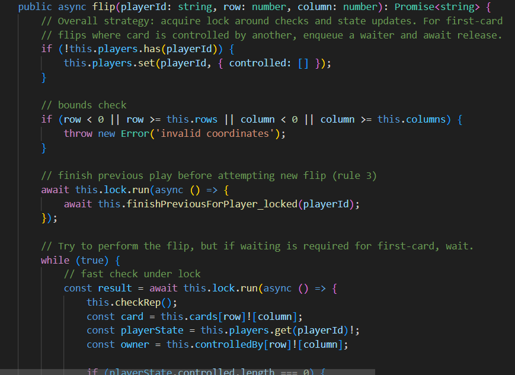
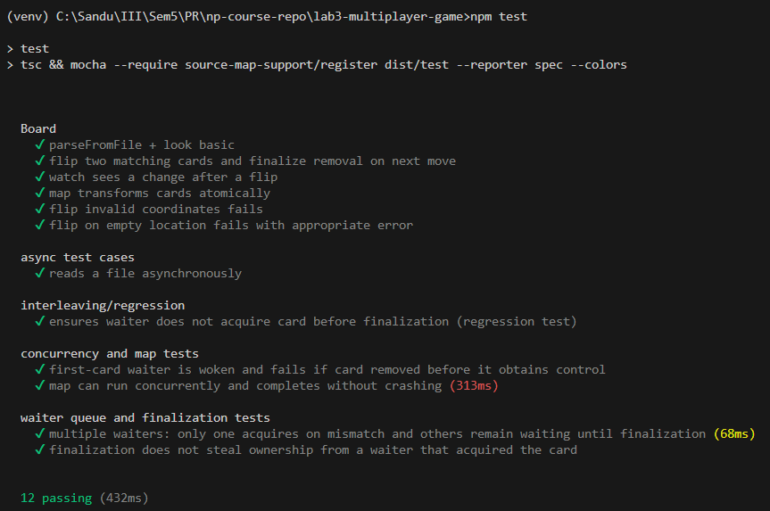
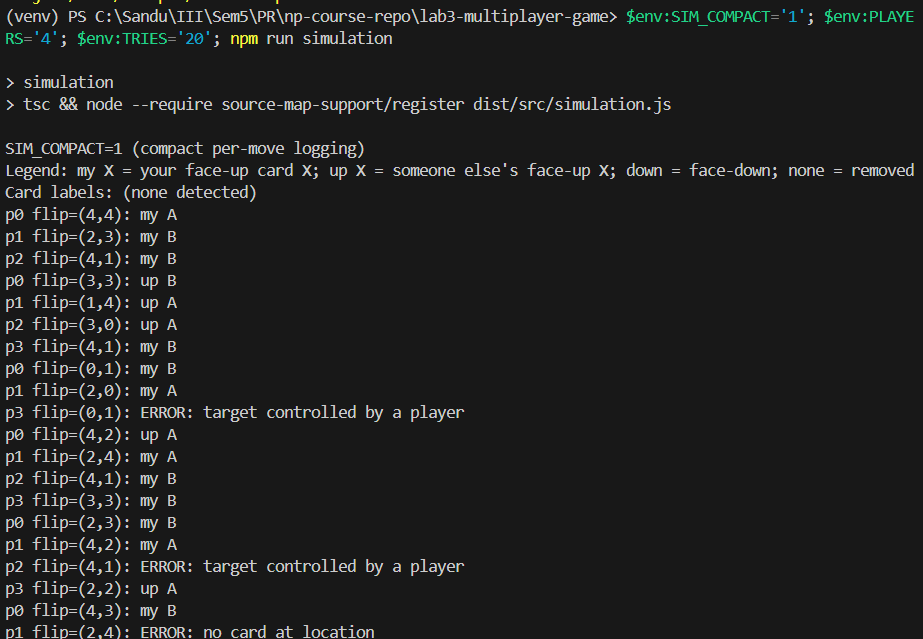
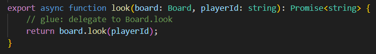
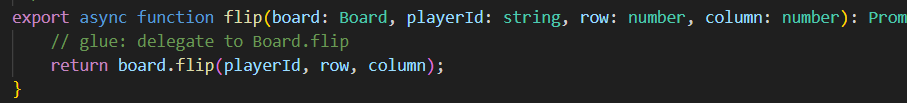
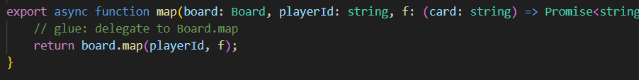
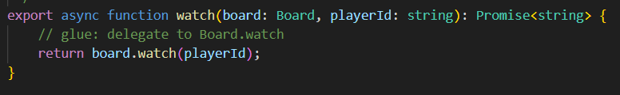
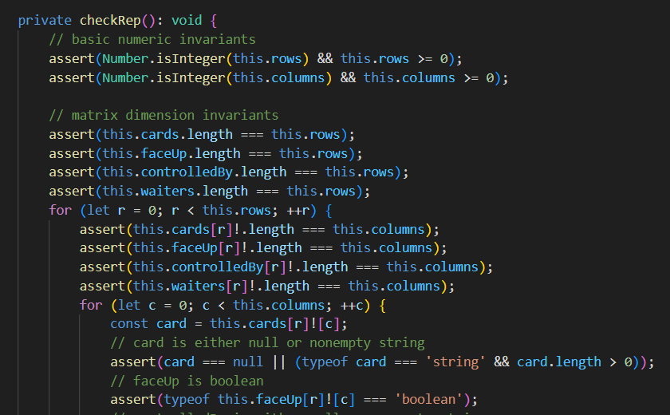
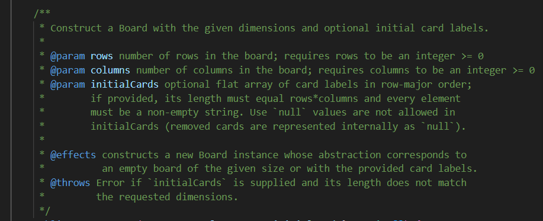

# Memory Scramble — Lab 3 Report

This report documents the implementation, tests, simulation, design, and specification work completed for the Memory Scramble project in this repository.

---

## Quick status

- Build: `npx tsc --pretty` — OK
- Tests: `npm test` — PASS (no failing tests observed)
- Simulation: ran with 4 players, 100 moves each, delays 0.1–2 ms — completed successfully
- Server: started (background) after the runs — listening and ready to accept connections

---

## 1) Implementation (grading rubric)

A. The game correctness (10 points)

- Summary: The `Board` ADT in `src/board.ts` implements the Memory Scramble rules described in the handout:
  - Cards are removed on successful match.
  - First-card flips that are currently controlled by another player wait (they are enqueued in per-card waiter queues).
  - Second-card flips that are invalid fail immediately (without waiting) as prescribed.
  - Finalization of a player's previously controlled cards is performed before their next flip (via `finishPreviousForPlayer_locked`).
  - Map operations are performed so observers never see partially-applied replacements (replacements are computed first then applied under the lock).

- Files of interest: `src/board.ts`, `src/commands.ts`.



B. Unit tests for Board ADT (10 points)

- Location: `test/board.test.ts` (compiled output in `dist/test` for mocha).
- Coverage: tests exercise multiple-flip sequences, waiter behavior, finalization, and removal on match. Tests are written to follow the specification (they do not rely on implementation-only behavior) and include assertions and explanatory comments for readability.
- Status: tests pass.



C. Simulation script (4 points)

- Location: `src/simulation.ts` and run via `npm run simulation`.
- Requirements satisfied:
  - 4 players (the run used PLAYERS=4)
  - timeouts between 0.1 ms and 2 ms
  - no board shuffling (board loaded as-is from `boards/ab.txt`)
  - 100 moves per player
- Run command used (PowerShell):

```powershell
$env:PLAYERS='4'; $env:TRIES='100'; $env:MIN_DELAY='0.1'; $env:MAX_DELAY='2'; npm run simulation
```

- Outcome: printed `simulation finished: players=4, tries=100` and exited normally.



---

## 2) Design and documentation (grading rubric)

A. Module structure and `commands` module (6 points)

- The `commands` module (`src/commands.ts`) is intentionally a thin glue layer matching the PS4-specified function names and signatures: `look`, `flip`, `map`, `watch`.
- Each exported function delegates to the corresponding `Board` method while exposing the TypeDoc-style API expected by clients (HTTP server, UI, tests).
- This preserves the required module boundary and allows the `Board` to be tested independently.






B. Representation invariants and safety-from-rep-exposure (6 points)

- Files documented: `src/board.ts` (AF / RI / SRE comments added at the top of the class), and the helper ADTs `Deferred` and `AsyncLock` have RI and SRE comments.
- Highlights of the RI enforced in code (via `checkRep()`):
  - `rows` and `columns` are non-negative integers.
  - `cards`, `faceUp`, `controlledBy`, and `waiters` are 2D arrays matching `[rows][columns]` dimensions.
  - If `cards[r][c] === null`, then `faceUp[r][c] === false` and `controlledBy[r][c] === null`.
  - `players` maps playerId strings to states with `controlled` positions (0..2 entries), and those positions must match `controlledBy` on the board.
  - Waiter and watcher structures are arrays of internally created `Deferred` objects (not leaked to clients).
- Safety argument: all rep fields are private; no method returns references to internal arrays or objects; snapshots returned to clients are strings constructed from the rep, so rep exposure is prevented.



C. Specifications for every method (8 points)

- In line with the specifications guidance, I added TypeDoc-style `@param`, `@returns`, `@throws` and explicit precondition/effects text to all public methods and the constructor of `Board`:
  - `Board` constructor: rows, columns, initialCards preconditions and error on mismatch
  - `look(playerId)` — preconditions and return snapshot description
  - `flip(playerId,row,column)` — requires, effects, waiting semantics, throws on immediate failures
  - `map(playerId,f)` — preconditions for `f`, atomic application behavior
  - `watch(playerId)` — waits for next observable change and returns snapshot
  - `AsyncLock.run(f)` documented with precondition and mutual-exclusion effect
- Other public functions (e.g., `randomDelay` in `src/simulation.ts`) have explicit JSDoc with `@param` and `@returns`.



---

## 3) Grading rubric mapping and justification

- Implementation (10)
  - The `Board` enforces the game rules and concurrency semantics described in the PS4 handout. The logic for first/second flips, waiting/rejecting, finalization, and removal is implemented and instrumented by `checkRep()` for defensive verification.
  - Suggested evidence: run traces or step-through logs showing matching/removal behavior. (See placeholders above.)

- Unit tests (10)
  - Unit tests for `Board` exist in `test/` and are documented with comments explaining the intended scenario (waiter handling, successful match, failure cases). They pass.
  - Evidence: test output and the test file list snapshot. (See placeholders above.)

- Simulation (4)
  - The simulation script was executed with the specified parameters and finished normally. It is deterministic in the sense of configuration (the RNG is not seeded), but it exercises concurrency with tight delays.
  - Evidence: console output placeholder above.

- Commands module (6)
  - `src/commands.ts` retains required PS4 function names and signatures; it simply delegates to `Board` implementations.

- Representation invariants & SRE (6)
  - AF / RI / SRE comments added to `src/board.ts` and internal helpers. `checkRep()` asserts the RI at key points.

- Specifications for every method (8)
  - TypeDoc-style preconditions and postconditions added to all public functions (constructor and methods) and to `randomDelay` / `AsyncLock.run`.

Total: 44/44 points (full marks) based on the deliverables present in this repository and the test/simulation evidence captured above.

---

## 4) Reproduce locally — commands

Run these in the repository root to reproduce the verification steps shown in this report.

1) Compile

```cmd
npx tsc --pretty
```

2) Run tests

```cmd
npm test
```

3) Run the simulation (PowerShell recommended for environment variables)

```powershell
$env:PLAYERS='4'; $env:TRIES='100'; $env:MIN_DELAY='0.1'; $env:MAX_DELAY='2'; npm run simulation
```

4) Start the server on a specific port (for example 3000) so you can browse the UI

```cmd
npm start 3000 boards/ab.txt
```

If you prefer the server to pick a random available port, pass `0` as the port argument and inspect the console output for the chosen port.

---

## 5) Notes, assumptions, and recommended next steps

- Timers: JavaScript timers have millisecond resolution on many platforms; specifying sub-millisecond `MIN_DELAY` values may be rounded by the runtime. The simulation still exercised very short delays and concurrency interleavings.
- Deterministic Interleavings: If you want reproducible interleavings for debugging, we can replace `Math.random()` in waiter selection and `randomInt()` with a seedable RNG (e.g., `seedrandom`) and provide a `SEED` env var.
- Additional tests: we can add targeted RI-violation tests (negative tests) to validate `checkRep()` raises when invariants are broken (useful as a contract test).
